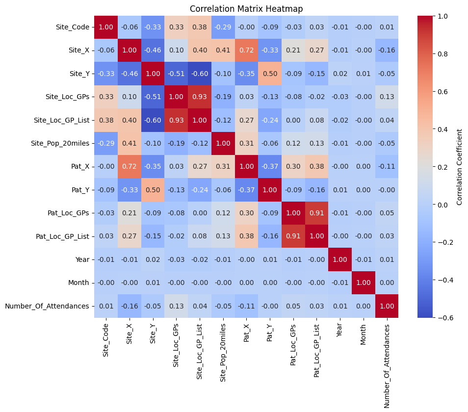
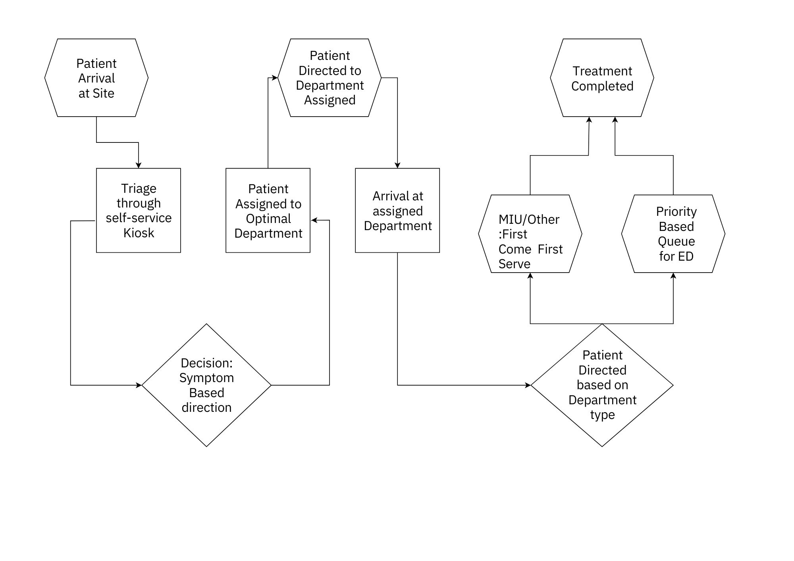
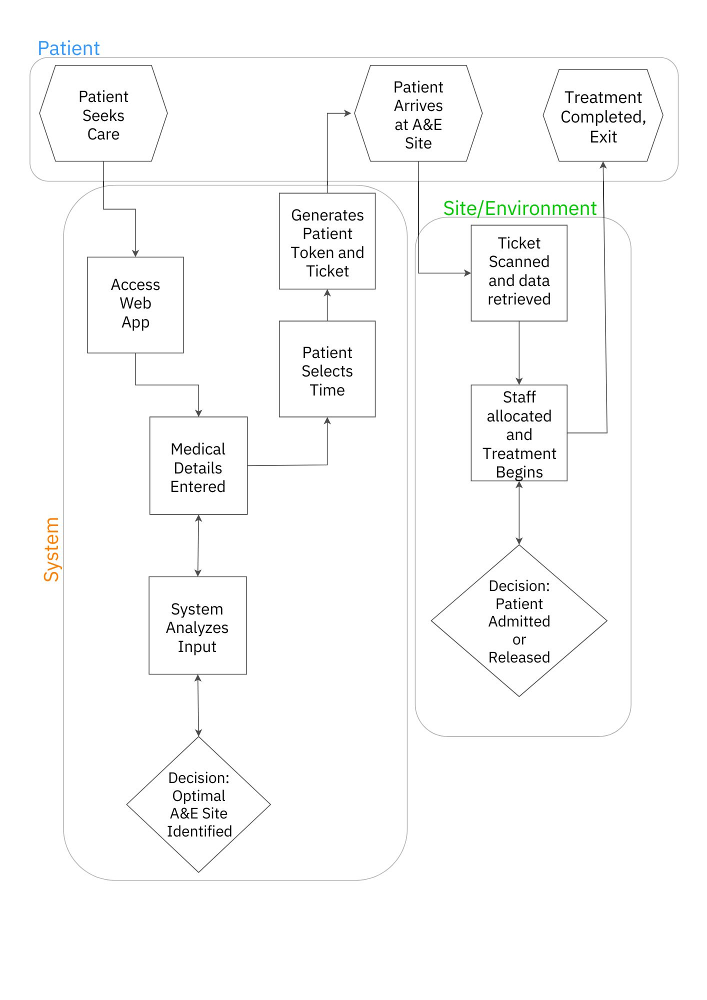
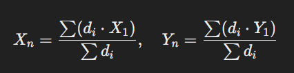
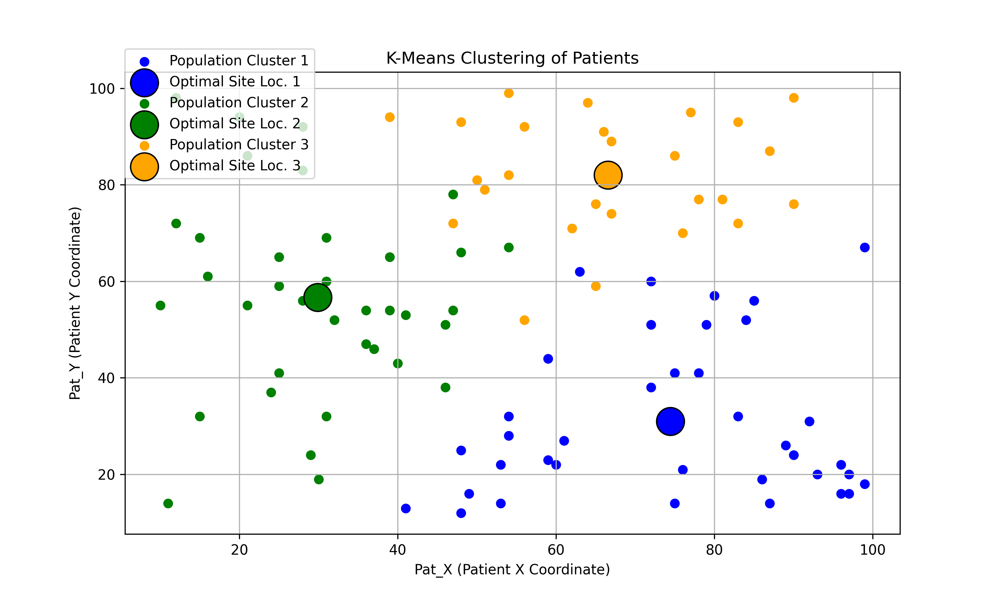
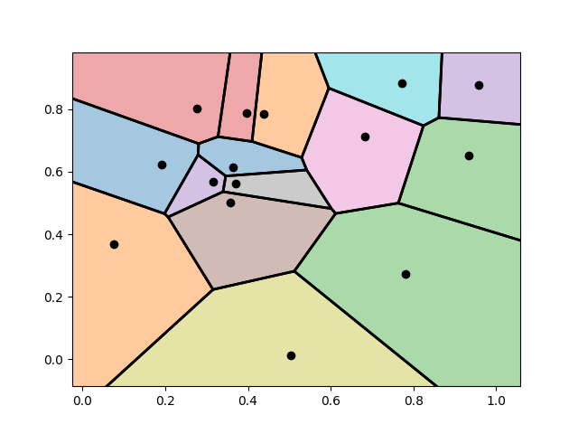

# Operational Research Challenge

## Problem Formulation 
### Part One: The central problem we aim to solve is optimizing the allocation and utilization of Accident & Emergency (A&E) services within a defined geographic area. This includes minimizing unnecessary use of A&E services, improving patient flow efficiency, and ensuring that patients receive timely and appropriate care.

# Key Questions to Address
 - How can we reduce unnecessary A&E attendances through reallocation and pre-arrival guidance?
 - What are the optimal resource allocation strategies to minimize waiting times at A&E?
 - Where should additional resources (e.g., MIUs, GP capacity) be allocated geographically to ease pressure on A&E?
 - How do different attendance types (e.g., planned, unplanned, frequent re-attenders) impact A&E demand and resource needs?
 - How can we improve patient understanding of the best facility to visit based on their condition?

## Data Collection
### Since all the data has already been provided already, here is a heatmap created to show the correlation between each data definition. The Correlation is being shown using the Spearman's rank Correlation. [From google - In statistics, Spearman's rank correlation coefficient or Spearman's ρ, named after Charles Spearman and often denoted by the Greek letter or as, is a nonparametric measure of rank correlation. It assesses how well the relationship between two variables can be described using a monotonic function.]

## Objective: Focus on Worst Case Scenario
### By using the worst-case scenario as the foundation for planning, the solution is designed to remain robust and efficient even during peak demand periods. 
### Optimize patient flow and resource allocation in A&E departments under the worst-case scenario: all patients are unplanned, requiring immediate attention.

## Mathematical Modelling - Queuing Theory & Loading Function for Managing Patient Flow

### Queuing Theory for Grouped Patients
To simplify the complexity of patient management, categories are grouped and modeled to address their specific needs:
 - MIU/Other:
    - Treated as First Come First Serve (FCFS) for low-acuity cases.
    - Simplified queue for predicting wait times and optimizing resource allocation (eg. triage nurses, rooms)
    - Goal: Minimize the wait times for minor injuries, avoiding bottlenecks
 - ED (Emergency Department):
    - Modeled as Priority Queuing System for high-acuity cases.
    - Cases with priority:
       - High-priority cases bypass queues for immediate attention.
       - Low-priority cases wait until resources are free.
    - Objective: Minimize delays for critical patients while balancing fairness for all.
      
### Loading function for System-Wide Balance
The Statistical/ML Approach
 - To optimize resource distribution and patient flow across multiple sites, a loading function is used, incorporating real-time data:
    - Load Score = { (Beds Occupied / Site Capacity) * 100 } + { (Wait Time(mins) / Critical Wait Time(mins)) * 100 } 
       1. (Beds Occupied / Site Capacity) : This term represents the percentage of beds currently in use at the site, giving a clear and intuitive indicator of how full the site is. Example: If 80 out of 100 beds are occupied, this component will contribute 80% to the Load Score.
       2. (Wait Time / Critical Wait Time) :
          - Wait Time - The patient wait time needs to be incorporated in a way that reflects its severity.
          - Critical Wait Time - Normalizes wait time by dividing the actual wait time by a critical threshold (e.g., 240 minutes = 4 hours).
    - Interpretation: If the Load Score is 100% or more, the site is overloaded. Scores under 80% indicate a manageable load, suggesting the site can still handle additional patients.
    - Sample Scenraio:
        - Scenario 1: Manageable Load
           - Beds Occupied: 60
           - Site Capacity: 100
           - Wait Time: 30 mins
           - Critical Wait Time: 240 minutes
           - Load Score -> { (60 / 100) * 100 } + { (30 / 240) * 100 } = 60 + 12.5 = 72.5%
           - Interpretation: The site is operating well within the Load Score.
             
        - Scenario 2: Critical Overload
           - Beds Occupied: 95
           - Site Capacity: 100
           - Patient Wait Time: 300 mins (5 hours)
           - Critical Wait Time: 240 minutes
           - Load Score { (95 / 100) * 100 } + { (300 / 240) * 100 }  = 95 + 125 = 220%
           - Interpretation: The site is severely overloaded, both in bed occupancy and wait times, requiring immediate re-direction of patient flow.
         
## Courses of Action: Airport Flow Management + Casino Psychology hybrid approach to streamline patient flow
### An Airport-Inspired Attendance Managemnet System
 - Segementation and Pre-Sorting
     - Similar to how passengers are assigned to terminals and gates, patients are sorted pre-arrival based on:
        - Symptom severity
        - Wait times and Site capacity
        - Location and travel distance
     - Re-Routing:
        - Just as Airports manage over-crowding by re-directing passengers, patients are guided to nearby MIUs or GP to reduce A&E congestion.
          
## The Airport Analogy
### Airports are able to manage high volumes of people and effeciently direct to their gates while minimizing confusion and maximizing compliance with the system demands. We can take inspiration from this in the following ways: 
 - Segmentation and Pre-Sorting
    - At airports: Pssangers are sorted into different terminals, gates, or check-in lines based on their destination, ticket class, or security needs, minimizing bottlenecks and confusion. The new self-service kiosk system that passengers use to check-in, select seats and print boarding passes.
    - Applying it to the A&E: We can use a pre-arrival triage which can based on severity, age and attendance type. This can be acheived with mobile/web apps or kiosks present at the hospital sites that take the patients details and give a ticket and path to direct patients to:
       - Full A&E - The Emergency Department (for high-acuity cases)
       - Minor Injuries Units (for low-acuity cases)
       - GPs (for non-urgent cases)
    - Patients can self-report symptoms via apps before arriving. The app can also dynamically re-route them to the correct site on real-time factors like distance, wait time and availability.
         
- Visual Cues and Navigation
   - We can see that airports have clear signage and real-time updates that help guide the passengers to the where they need to be. Passengers receive immediate and location-specific messages about gates, amenities and services in their devices. Displaying real-time information on way finding at central points. 
   - Applying to the A&E: Implementing a clear signage and location-specific messaging system. This can be used to indicate priority lanes for elderly and new patients all while redirecting the other patients to the right service:
      - "For minor injuries, you will be seen faster at this MIU"
      - "Severe cases will be treated here; please proceed to A&E"
        
 -  Anticipatory Resource Allocation
    - At airports the number of service counters are open are adjusted dynamically based on the passenger inflow.
    - Applying to the A&E: Using real-time monitoring similar to boarding queues to shft staff between departments or adjust priorities. We can also use the historical data to find out patterns and predict the patient inflow to adjust staff and resources.

### Reason for using the <i>Loading Function</i> here?
 - The Loading Function quantifies how "loaded" an A&E site is in terms of its capacity and resources. It uses real-time data to dynamically assess site utilization, enabling informed decision-making to balance patient flow and optimize resource allocation.
 - Defining a Loading Function for A&E sites allows us to calculate how "loaded" each site is in real time. By using these scores to guide patient distribution and reduce imbalances across sites, we can optimize the flow of patients and ensure resources are used efficiently. This aligns with the principles of the Airport Style Management approach, which focuses on dynamic, data-driven decision-making to improve patient care.
   
<h3>Here is how we can integrate the loading function into the Airport Analogy</h3>
 - Real Time Monitoring: Calculate the Load Score for each site periodically (e.g., every 15 minutes). Using software to visualize site scores across a dashboard, highlighting overloaded sites for immediate action. 
 - Patient Reallocation: Redirect non-urgent cases to sites with lower Load Scores to reduce pressure. Include Load Score calculations in backend algorithms to recommend the most appropriate site for incoming patients. 
 - Strategic Planning: Analyze historical Load Scores to identify persistent bottlenecks and inform long-term capacity planning. Use insights from the function to determine where and when should resorces be deployed during crises. 
        
### Enhanced Airport-Style Management along with the Loading Function
  - Segementation and Pre-Sorting
      - Improvement with the Loading Function: In addition to patient severity and syptoms, the Load Score becomes a key-factor in the pre-arrival triage:
      - If Site A has a high load score and Site B has a low load score, non-urgent cases are rerouted to the Site B automatically.
  - Real-Time updates adjust these scores, ensuring dynamic re-allocation
  - Patients receive messages like:
     - <i>"Site A is currently full. Please proceed to MIU Site B for faster care"</i>
     - <i>"Estimated Wait Time at Site B: 2 hours. Estimated Wait Time at Site C: 30 mins"</i> 
  <b>Example: Apps or Kiosks can Compute the best A&E site option the following way:  Best A&E Site = min(Load Score + Travel Time)</b> 
 - Visual Cues and Navigation
     - Improvement with the loading function: Real-time load distribution is reflected in central signage or web apps, displaying current load and expected wait-times across A&E sites. The digital wayfinding signboards and directions will direct patients away from overburdened facilities towards less busy ones, reducing localised congestion. Example:
        - "Site A: 90% capacity. Est. Wait Time: 2 hours."
        - "Site B: 50% capacity. Est. Wait Time: 30 minutes."    
 - Anticipatory Resource Allocation
     - Improvement with the loading function: The loading function can also predict resource needs and aid in staff alocation. Additional staff are allocated pre-emtively, or lower-priority cases are rerouted to reduce incoming demand load. Site A's load score predicts a spike in demand on specific days or during specific months using historic data combined with real-time monitoring to anticipate patterns. Example:
        - "Site B witnesses a Monday morning surge, staff are scheduled accordingly."      
 ADD HOW THE PATIENT WILL GET THE E-TICKET FROM THE WEB - APP
### Achieving Pre-Sorting and Utilizing the Loading Function

Using a Web App: Patients access a user-friendly web app where they enter essential details such as their name, age, symptoms, and the location they will be traveling from. The app processes this information to:

1. Determine the Type of Care Needed:
 - Based on the symptoms provided, the system identifies whether the patient requires Emergency Department (ED), Minor Injuries Unit (MIU), GP services, or other care.
   
2. Identify the Optimal Site:
 - Using the Loading Function, the system evaluates all nearby sites to identify the one with the most manageable load for the patient’s care needs.

3. Generate a Patient Ticket:
 - The app provides the patient with a ticket containing:
  - Site Code: The identifier for the recommended site.
  - Site Type: Specifies the type of site (e.g., ED, MIU).
  - Site Location: Clear directions to the recommended site.
  - Ticket Number: A unique identifier for the patient.
  - Travel Time + Estimated Wait Time: Transparency on how long the journey and waiting might take.
    
4. Streamlined On-Site Process:
 - Upon arrival at the site, the patient shows their ticket, which can be scanned or manually referred to by staff.
 - The patient’s details, already entered through the app, are automatically loaded into the hospital’s system.
 - This allows for seamless registration and ensures the patient receives timely and appropriate care.       

### Casino Psychology for Behavioural Guidance
 - Use visual cues and choice framing to direct patient flow to optimal options:
    - Subtly encourage non-critical patients to select MIU/Other with prompts such as:
       - "Receive care faster at our MIU, specialized for cases like yours".
    - Real-time updates provide transparency, building trust in the system.
       
## Casino Psychology
### Casinos excel at altering people's perception of time to keep them engaged. Casinos also use specific colors, special lighting and even music to keep the people as relaxed as possible. Applying this concept for managing the patients' experience while they wait for their treatment will help reduce the mental stress and affect it has.  
### Get people to host Board games and invite the other people waiting in queue or just waiting around to spend time with the people around them, time flies when you play games. But what would happen if someone is in too deep playing the game rather hearing their number being called out.   
 - Environmental Variables
     - Casinos use environmental stimuli (lighting, layout, background music) to distract patrons and create a seamless flow.
     - Applying it to the A&E sites:
        - Introducing Pleasant lighting, soothing colors.
        - Using music or audio cues in waiting rooms to reduce stress and create a sense of progress. Examle. Notification - "You're number is next!".
 - Perception of Progress
      - People feel a sense of progress even when they are staionary, for example spinning wheels and flashy animations.
      - Applying it to the A&E sites:
         - Provide small "wins" like quicker assessments or initial consultations, without compromising the quality of the consultation, even if full treatment isn't immediate.
         - Giving people an udpate on the queue. Example:
            - "3 patients are ahead of you."
  - Controlled Choices
      - In casinos people are given apparent choices that feel empowering but lead them where the system wants.
      - Applying it to the A&E sites:
         - Creating a flow that directs people to the correct Site type by offering them guided choices. Example:
            - "MIU team at Site A is ready to assist you now."
            - "Would you like to skip the wait? Specialists at Site B are available immediately."
            - "We’ve reserved a spot for you at the MIU Site B. Follow the path provided for quick care.

## Event Driven Process Chain to Demonstrate the analogy in action.  Following Two scenarios:   

 <b>Event-Driven Process Chains (EPC) and State Tables</b>
 - Document the flow of patients through the system using EPCs or state tables to:
    - Identify ineffeciencies and decision points.
    - Clearly define transitions, eg:
       - Patient Arrival -> Triage -> Department Assignment -> Treatment -> Exit.
 - Incorporate automation triggers, eg: re-routing based on load scores.

### 1. Patient is at the site already.

### 2. Patient is not at the site(patient at home/office/etc.) - Care Routing System (CRS)

### Part Two: Expanding the Capacity in departments/creating new departments and see how the solution would change.

### Data Collection: To calculate where we must place the department we need to Collect the following data: Patient X, Patient Y, Distance to the closest department from each patient.

 - Things to consider:
    - Patients may not be at home, and dense population/traffic flow might be better indicators.
       
So instead of solely relying on Patients X and Y, integrate data about population density and traffic flow patterns for specific days and hours. Using the weighted-mean of high-traffic areas or population centres during peak demand times to better predict the optimal new department location. Leveraging data like: mobile phone density or traffic counters (if available) and Pat_Loc_GPs to identify regions with high patient registrations.

<h4>New Satellite Sites Integrated with Emergency, Minor Injuries Unit, and GP Services</h4>

Create new, smaller-scale sites integrated with **Emergency Life-Saving Services**, **Minor Injuries Unit (MIU)**, and **GP services**. These satellite sites will be associated with **Main Sites**, ensuring a seamless connection to higher-level care when necessary. The satellite sites will act as a first point of care, providing life-saving support and essential services until a patient can be transferred to the main site if their condition escalates.
 
Each satellite site will be tagged with a **Site Code**, associating it with its corresponding Main Site to ensure continuity of care. This avoids isolating critical care services and enables efficient escalation protocols. For example, a satellite site associated with Site_Code: 2 could also handle **telemedicine consultations** or **urgent care services**. Clear rules will be in place for transferring patients with escalating conditions from satellite sites to their associated Main Site. For instance, if a patient’s condition is flagged as critical at a satellite unit, immediate transport to Main_Site will be initiated. In the meantime, the satellite site will provide essential life-saving care, acting as a critical support system until the patient reaches the main A&E facility.

  <h4>Assumptions</h4>
  
We will also make the assumption that the optimal site that we have found is either empty or has an available space to incorporate the new department. While assuming available space is practical for initial calculations, it is essential to analyze real-world constraints like land availability, building costs, and zoning laws. Using cost-weighted decision-making to prioritize feasible locations. we must also consider the Main Site transport feasbility. Ensure that transport infrastructure supports quick patient transfers between satellites and main sites. Factoring in the availability of an ambulance and average response times.

       
### Using Weighted Mean of Data to find the Optimal Location for Creating new Departments
 
How it would work: 
 - For each patient, calculate the distance to the closest department.
 - Store the distances in an array and sort it in descending order. Sort distances to identify outliers that might disproportionately influence the mean. Consider limiting weights for patients far outside the target area (eg. > 40 miles).
 - Take the Weighted Mean of their X and Y co-ordinates: This will be the New Departments location. 

 - Formula -> Weighted Mean = (Items * Weight) / Sum of all Weights
   - Items: represents Patient X and Y (separately)
   - Weight: represents the distance for each patient to the closest department
   
  
  
  
   
  
  Meaning of the Symbols -  
   - Xn : is the X co-ordinate for the new department.
   - Yn : is the Y co-ordinate for the new department.
   - ∑ : is the Symbol for Summation or to declare that we must take the sum of all values present.
   - di : is the the distance for each patient to the closest department
   - X1 : is the X co-ordinate of the patient
   - Y1 : is the Y co-ordinate of the patient

  <h4>An Alternative to Simplify the Calculation</h4> 
  To simplify calculations we can group patients by postcode or GP cluster. Reverse-Engineering the Pat_Loc_GPs we can group patients by postcode or GP area to simplify calculations for the weighted mean. Aggregate data by groups, then using Pat_Loc_GPs as a proxy for grouping patients into clusters. For Example:
   - Patients within the same postcode or within a specific radius of a GP cann be treated as a single group.
   - Assign a central point for each group, reducing the computational complexity.   

  <h4>Visualizing the Weighted Mean of the data using K-Means Clustering and Vonoroi Diagram</h4> 
  To enhance the current method by we are integrating K-Means Clustering to find the optimal locations for new departments and improve demand distribution, visualizing it on a Vonoroi Diagram. 

## K-Means Clustering

Is a technique used in data analysis to group similar similar data points together. It's like sorting a collection of items into categories based on their characteristics, so that items in the same category (or group) are more similar to each other than to items in other categories. In K-Means, K represents the number of groups (or clusters) we want to create. The algorithm works by:

  - Choosing K initial cluster centers (called centroids) at random.
  - Assigning each data point to the closest centroid.
  - Recalculating the centroids based on the new groupings of data points.
  - Repeating the process until the centroids no longer change significantly, meaning the data has been grouped in the best possible way.

### K-Means Clustering: In the context of the problem
 - In the context of our problem, we have patient locations (their coordinates) and we want to determine optimal locations for new A&E departments or services.
 - Patients are spread out over a geographic area, and some areas may have more patients than others. By using K-Means Clustering, we can group patients based on their geographic proximity and demand.
 - The centroids (center points) of these clusters can represent ideal locations for new departments, such as Minor Injury Units (MIUs), to help spread out the patient load and make care more accessible.

### K-Means Clustering: Usage
 <b>1. Collecting Patient Data:</b> Gather patient location data using coordinates (Pat_X, Pat_Y). These represent where patients are distributed geographically. 
 <b>2. Applying K-Means Clustering:</b> Use the K-Means algorithm to group patients into clusters based on their locations. The number of clusters (K) corresponds to the number of new departments we aim to explore. 
 <b>3. Identifying Optimal Sites:</b> The centroids of these clusters represent the best potential locations for new departments, positioned to serve the highest number of patients efficiently. 
 <b>4. Validation:</b> Evaluate whether these locations improve patient access by reducing travel times and balancing patient loads across existing and proposed sites. 

The Images below illustrate how the K-Means Clustering works. The smaller circles are the Pat_X and Pat_Y. While the bigger circles are centroids. 
The website below can be used as a tool to demostrate how we will implement it. Illustration of K-Means Clustering Workflow: 
 
 - <b>Initialization:</b> Begin with all patient points (small circles) ungrouped. Randomly place a specified number of centroids (representing potential new departments). In this example, there are 3 centroids. 
 - <b>Assigning Points to Clusters:</b> Each patient point is assigned to the closest centroid. The points take the same color as their nearest centroid, forming temporary clusters. 
 - <b>Updating Centroids:</b> Calculate the mean of all points in each cluster. Move the centroid to this new, more optimal position. 
 - <b>Reassignment of Points:</b> Points are reassigned to the updated centroids based on proximity. Colors are adjusted to reflect the new cluster assignments. 
 - <b>Iteration:</b> Steps 3 and 4 are repeated until centroids stabilize, meaning their positions no longer change. 
 - <b>Result:</b> Once stable, the final centroid positions represent the optimal locations for new sites or departments. 
   
<b>From youtube channel: TheDataPost | Link to Video: https://www.youtube.com/watch?v=R2e3Ls9H_fc </b>
<b>K-Means Clustering website from youtube channel: TheDataPost https://www.naftaliharris.com/blog/visualizing-k-means-clustering</b> 
 

## Vonoroi Diagram

A Voronoi Diagram is a way to divide up a space into regions based on the proximity to a set of points. These points are called seeds (or centroids in our case). Imagine a map with several hospitals (seeds). A Voronoi diagram shows which parts of the map are closest to each hospital. Every point within a region belongs to the hospital closest to it. The edges of the regions represent the boundary where a patient is equidistant between two hospitals. In simple terms, a Voronoi diagram tells you which hospital serves which patients based on distance.
 

### Vonoroi Diagram: In the context of the problem
 - After using K-Means Clustering to find the optimal department locations, we need a way to visualize how patients would be allocated to these new locations.
 - A Voronoi diagram will help us visualize the catchment areas of each new department, showing exactly which patients would be directed to which department based on proximity.
 - This visualization is important because it helps us understand whether the new department locations are serving the right areas and whether they can handle the patient load effectively.

### Vonoroi Diagram: Usage
 <b>1. Collecting the Centroids:</b> After applying K-Means Clustering, we obtain centroids representing potential new department locations. 
 <b>2. Creating the Voronoi Diagram:</b> These centroids serve as seeds in the Voronoi diagram, dividing the geographic area into regions based on proximity to each centroid. 
 <b>3. Visualizing Allocation:</b> The diagram highlights the catchment areas for each department, showing how patients are distributed across locations. 
 <b>4. Identifying Gaps or Overlaps:</b> Regions with no coverage or excessive overlap between sites become visible, helping identify underserved areas or opportunities to adjust department locations. 

The Images below illustrate how the Vornoi Diagram is being used to visulize the location for the new sites/departemnts. Illustration of Voronoi Diagram Workflow:
  
 1. Seeds (Centroids): The centroids (points on the map) represent the locations of new sites or departments. 
 2. Regions (Catchment Areas): The colored regions depict the areas assigned to each site, divided by borders to clearly differentiate the coverage of neighboring sites. 
 3. Coverage Visualization: The diagram helps visualize how well the new departments serve the surrounding areas. 

 
Applications of the Voronoi Diagram:
 
  1. Backend System Integration: 
   - Use the Voronoi diagram to dynamically assign patients to the nearest site. 
   - When a patient’s location is provided (Pat_X, Pat_Y), the Voronoi diagram determines which department serves them best, ensuring efficient redirection. 
  2. Road Signage and Patient Navigation: 
   - Place simplified Voronoi-based signs at key junctions or highways to guide patients. 
   - These signs show nearby sites, their coverage areas, and directions based on the patient’s current location. 
  3. Identifying Gaps in Coverage: 
   - Regions far from any centroid indicate underserved areas, helping identify where to place additional MIUs or A&E departments strategically. 
  4. Dynamic Resource Allocation: 
   - Update the Voronoi diagram in real-time to reflect changes in patient load, site capacity, or new department placements. 
   - Use it for backend logic in dynamic routing systems and resource distribution. 

The Voronoi diagram is an essential tool for visualizing patient distribution, identifying underserved areas, and making informed, geography-based decisions for improving emergency care access. Key Benefits of Using Voronoi Diagrams:
 
 - Dynamic Routing Systems: 
  - Backend logic for efficient patient redirection based on real-time proximity. 
 - Resource Optimization: 
  - Visualize coverage and site loads for better allocation of resources. 
 - Patient Guidance: 
  - Use road signs, kiosks, and apps to reduce confusion and simplify navigation. 
 - Strategic Planning: 
  - Simulate and decide on new site placements or expansions to improve overall system coverage. 

<b>From youtube channel: Revision Village | Link to Video: https://www.youtube.com/watch?v=LOxlRQqHjs4 </b>
 

### Integrating K-Means Clustering and Vonoroi Diagram
 - K-Means Clustering groups patients by their geographic location and demand, helping us identify optimal department locations.
 - Voronoi Diagrams then visualize how these locations will divide the area into catchment regions, showing how patients are distributed and allocated to departments.
 - Combined, these tools ensure that we are:
     - Placing new departments in the most needed areas, reducing travel times and balancing patient demand.
     - Visualizing patient allocation, so we can tweak department locations to better serve the population.
 - By applying both K-Means Clustering and Voronoi Diagrams, we create a powerful framework for optimizing A&E department locations and improving overall patient flow.

## Expanding Capacity in Existing Departments
When faced with the challenge of increasing capacity in healthcare facilities, this approach prioritizes feasibility and efficiency. Before considering the creation of new departments, first evaluation— whether expansion is possible within existing sites. This involves assessing available space and determining if additional capacity can be accommodated effectively.

If expansion is viable, direct focus on increasing staffing levels and patient beds to enhance the facility's ability to handle surges in patient demand. However, in scenarios where physical expansion is constrained—either due to space limitations or logistical challenges— deploy re-purposed Mega Hauler Trucks and Shipping Containers housing the complete suite of technology and bedding that is able to provide full care to patients, serving as temporary extensions to existing facilities, providing crucial support during high-demand periods.

This dual-layered strategy ensures that healthcare systems remain adaptive and scalable, meeting patient needs efficiently without the need for costly and time-consuming permanent infrastructure changes.

### HERO: Health Emergency Response Operations

### Addressing the Expansion

1. Space Readiness for Expansion:

Acknowledging the importance of ensuring that any available space is not already being utilized for other purposes, a thorough assessment will be conducted to identify areas that can be converted quickly and efficiently when needed. These spaces will be maintained in a ready-to-use condition, ensuring minimal downtime when expansion is required.

2. Pre-Designed Trucks and Containers:

Instead of committing significant funds to the construction of permanent expansions, which require substantial time, money, and planning, allocating these resources to pre-designed and repurposed trucks and shipping containers. These units will be fully equippedw ith beds, equipment, computers and ready to deploy during times of extreme need, ensuring a cost-effective and scalable solution to temporary capacity challenges.

3. Integration with Main Sites:

Integration between the trucks, containers, and main sites will be streamlined using the same software system currently employed at the main sites. By simply labeling the mobile units as extensions (e.g., "Mobile Unit - Site Code: N"), the system will maintain seamless operations, including patient record management, staff allocation, and resource tracking. Using the existing software as a main sites make this a straightforward process, minimizing the potential for disruptions or inefficiencies.

4. Clear Communication and Signage:

To ensure clarity for both patients and staff, large, clearly visible signage will be placed on these mobile units. The signage will explain the purpose of the trucks and containers and direct individuals to their specific locations, eliminating confusion about why they are being directed to these temporary facilities.
Purpose and Role of Trucks and Containers

The primary purpose of these mobile units is not to replace the existing sites but to alleviate the load on these facilities during times of high demand. These trucks and containers will act as temporary extensions, providing care for minor issues and diseases and ensuring that no patient is left standing or unattended for hours during chaotic times.

Taking into account that in extreme cases, even these mobile units may become overcrowded. However, the goal is not to eliminate all delays but to keep the flow of traffic moving smoothly. Even if the process is slower, maintaining a steady flow ensures that care is provided, and the system remains functional rather than coming to a halt due to the overwhelming demand.

5. Staff Readiness Plan:

While the physical infrastructure (trucks and containers) is ready for deployment, it’s equally crucial to have a standby staffing plan. This could include:
 - A roster of on-call staff trained to work in these temporary units.
 - Partnerships with local healthcare providers or temporary staffing agencies to fill gaps quickly.

6. Modular Flexibility for Containers:

Equip containers with interchangeable interiors so they can serve multiple roles (e.g., triage, diagnostics, or even administrative functions) based on the needs of the site. For example, during one surge, a container might act as a vaccination center, while in another it serves as a diagnostic lab.

7. Digital Queue Management:

 - Using the same digital queue management system accessible via a web applications or kiosks at the site.
 - Patients can check estimated wait times for both the main site and mobile units.
 - This ensures transparency and helps patients understand why they are being redirected.

8. Multi-Purpose Design for Trucks and Containers:

 - Beyond healthcare services, these units can also serve other purposes during quieter periods, such as:
    - Community health education centers.
    - Vaccination campaigns or outreach initiatives.
    - Telemedicine hubs, providing remote consultations for underserved areas and over crowded areas.
      
### Note: Where will the people wait for the Mobile Units as you know Scotland can indeed get very cold and standing outside is just not very comfortable. What will be the waiting area for these Mobile Units?

### Based on all of this how would the solution change:
   <h4>Existing Solution includes: </h4>
    - Queuing Theory: No Change required for this as it can be applied to the Mobile Units as well.
    - Loading Function: The loading function will updated here and instead of using the large scale version where we would find the optimal Site Locationfor the patient, we will use the loading function on a smaller scale to direct patients to either the Main SIte or the Mobile Units based on the Patient_Wait_Time/Age_Group/Symptom_Severity. Load Score adjusted to: Patient_Wait_Time + Age_Group + Symptom_Severity.  
    - Airport Style Management System:
      - Self-Service Kiosk: Will also be updated
      - Clear Signage: No Change, there will still be clear signage for directing the patients to in the Main Site Building or the Mobile Units.   
      - Screens Displaying the real-time data: All the screens displaying the real-time data will show a split view of the data between the Main Site Building and the Mobile Unit at the Site.    
      - Pre-Sorted Ticket: The Pre-Sorted ticket  
    - Casino Pschology: No change here either, the same 
  
## Choosing Resolving Method 
### Analyze the Alternatives to understand outcomes of each (consequences) 
### Comparison of the consequences and selection of the right alternative

## Resolving Problem
### Results and Conclusions

## Implementation of Solution
### Implementation of the result and evaluation of the degree/percentage of success.
