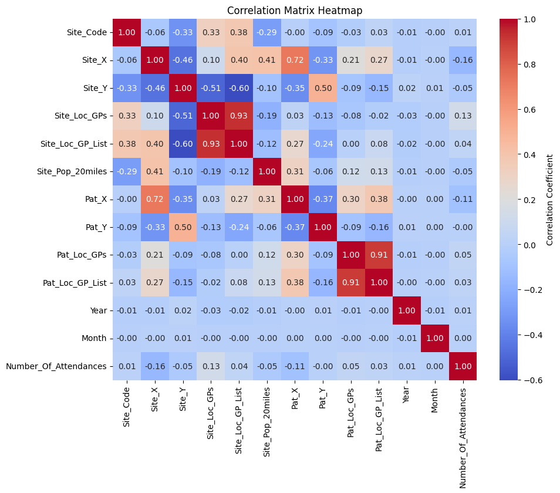
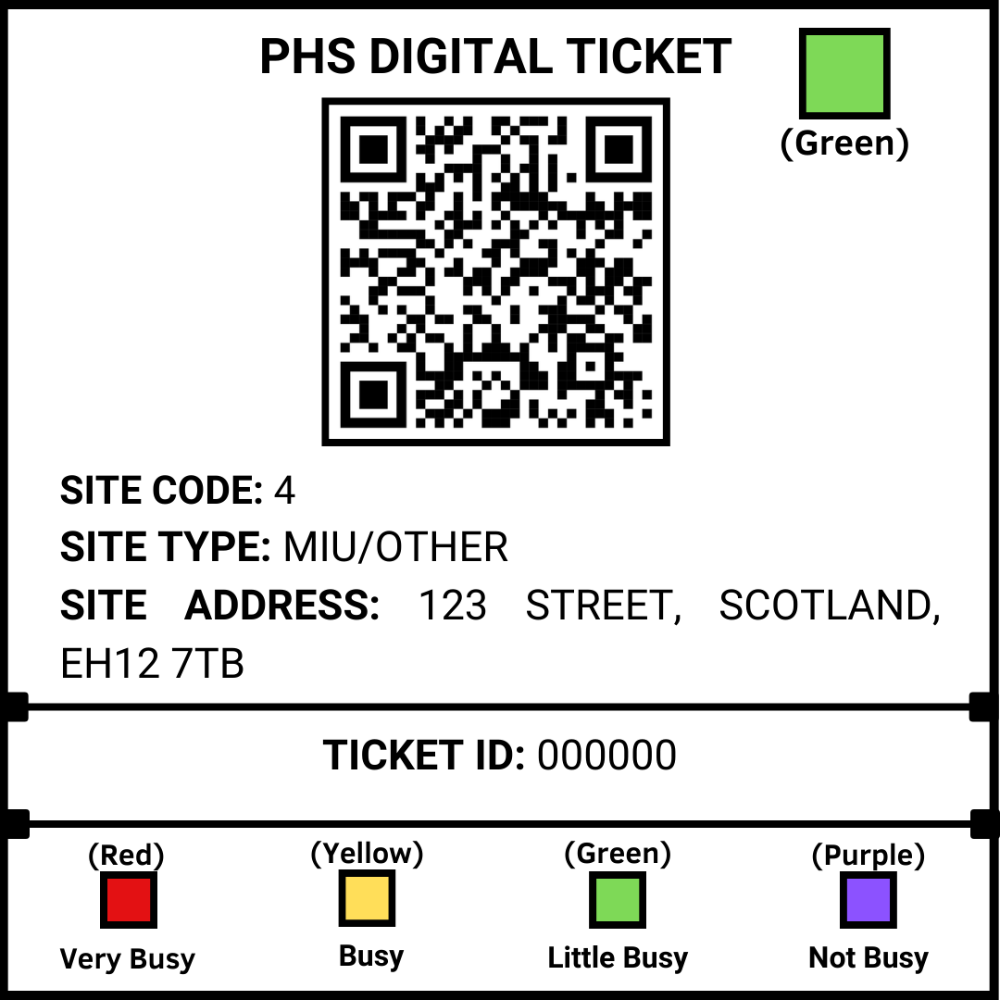
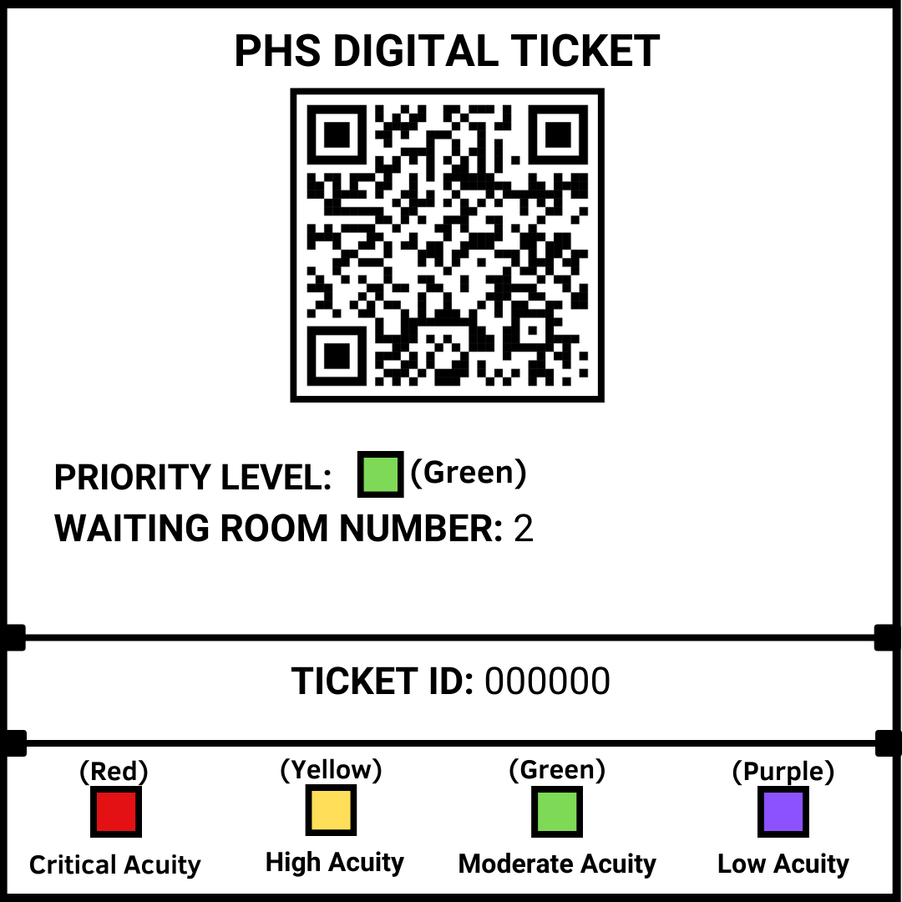
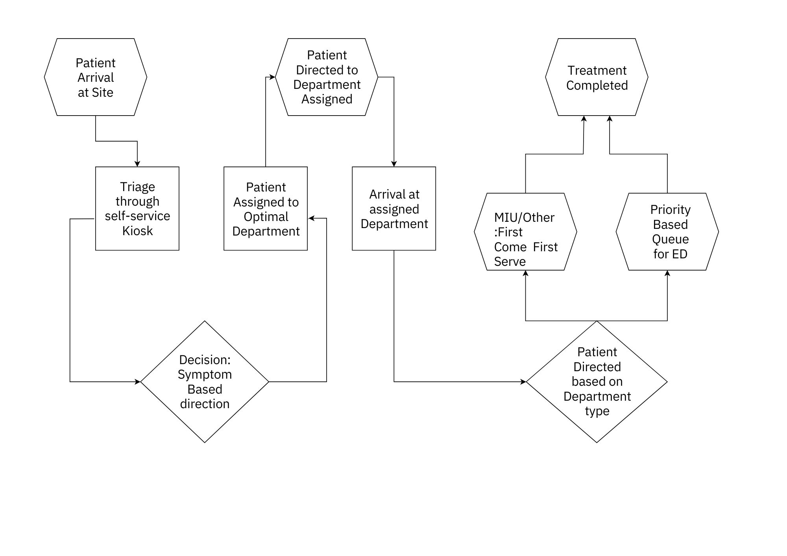
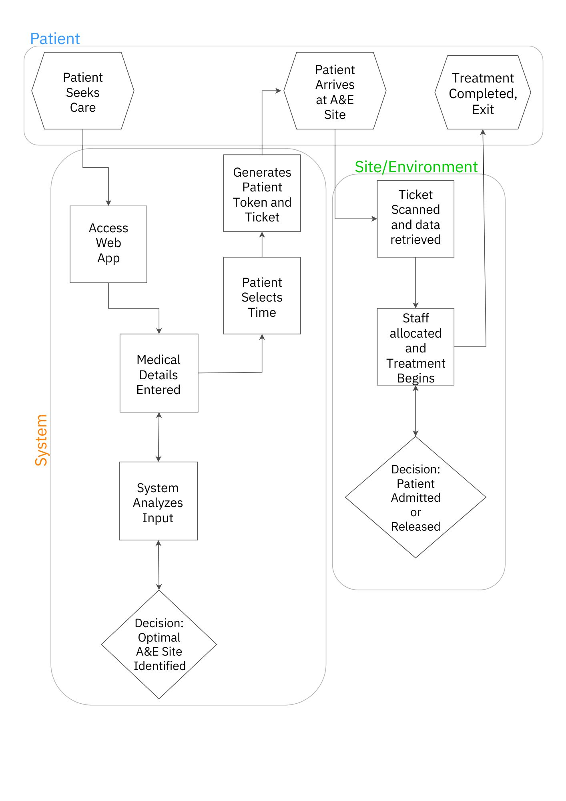
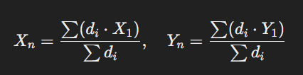
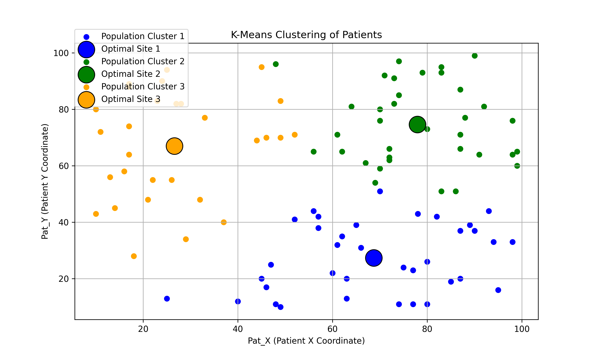
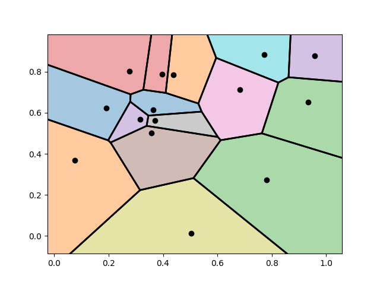

# Operational Research Challenge

### The Structure that we will implement for this report: The Problem - The Methodoly we used to solve it - Details of the solution with the diagrams to support the theory Diagrams
(This is to get the reader interested from the start)

## Problem Formulation 
### Part One: The central problem we aim to solve is optimizing the allocation and utilization of Accident & Emergency (A&E) services between departments provided. This includes minimizing unnecessary use of A&E services, improving patient flow efficiency, and ensuring that patients receive timely and appropriate care.

# Key Questions to Address
 - How can we reduce unnecessary A&E attendances through reallocation and pre-arrival guidance?
 - What are the optimal resource allocation strategies to minimize waiting times at A&E?
 - Where should additional resources (e.g., MIUs, GP capacity) be allocated geographically to ease pressure on A&E?
 - How do different attendance types (e.g., planned, unplanned, frequent re-attenders) impact A&E demand and resource needs?
 - How can we improve patient understanding of the best facility to visit based on their condition?

## The Correlation Matrix
### What is a Correlation Matrix -- A correlation matrix is a table that shows the correlation coefficients between variables. These coefficients measure the strength and direction of relationships: 

 - Values range between -1 (perfect negative correlation) and 1 (perfect positive correlation).
 - Positive correlation: As one variable increases, so does the other.
 - Negative correlation: As one variable increases, the other decreases.
 - Values near 0: Little to no linear relationship between the variables.

<h3>Purpose and Usage of the Correlation Matrix</h3>

At the outset of this study, a correlation matrix was utilized to statistically analyze how the various variables provided in the dataset interact and influence one another. The correlation matrix highlights the relationships between key attributes such as Site Code, Patient Coordinates (Pat_X, Pat_Y), Number of Attendances, and Resource Availability (e.g., Site_Loc_GPs). By doing so, it serves as a foundational tool to identify patterns, dependencies, and areas of focus for decision-making. The matrix was crucial in understanding which variables are strongly intertwined and could provide actionable insights. Examples of its application include:

 1. <b>Determining Key Relationships: </b> <u>Site_Loc_GPs and Site_Loc_GP_List (Correlation -> 0.93):</u> Indicates that areas with more GPs tend to have a higher number of patients registered with those GPs. This insight was used to assess how site resources and surrounding population densities interact.  <u>Pat_X and Site_X (Correlatio -> 0.72):</u> Shows a strong relationship between patient and site locations on the X-coordinate, which reinforces geographic proximity as a significant factor in patient distribution.
 2. <b>Identifying Variables with Weak or No Correlation: </b> <u>Site_Pop_20miles and Pat_Y (Correlation -> -0.06):</u> A negligible relationship suggests that the total population within 20 miles of a site does not directly correlate with patient Y-coordinates, indicating other factors (e.g., specific site types or referral pathways) may play a larger role in patient inflow.
 3. <b>Validating Assumptions for Resource Allocation: </b> <u>Number_Of_Attendances and Site_Loc_GPs (Correlation -> 0.12):</u> A weak positive relationship shows that the number of local GPs has a minimal direct impact on A&E attendances. This insight supports the focus on patient-centric factors like travel time, site capacity, and wait times, rather than relying solely on GP availability.

<h3>Why the Correlation Matrix Matters</h3>

The correlation matrix is not just a statistical tool but a decision-making guide that was instrumental in:

 - Prioritizing Variables for Analysis: Understanding which factors (e.g., patient location, site capacity, GP coverage) are most influential in patient flow and resource utilization.
 - Shaping Strategies: Using the identified relationships to design interventions like patient redistribution, optimal site selection and dynamic resource allocation.
 - Validating Methodology: Ensuring that the chosen methods align with the statistical realities of the dataset.

By incorporating the correlation matrix at the start of the analysis, we ensured that all subsequent decisions and models were grounded in data-driven insights, making the solutions more targeted, efficient, and impactful.

## Solving the Problem for the Worst-Case Scenario
### By using the worst-case scenario as the foundation for planning, this solution is designed to remain robust and efficient even during periods of peak demand. It optimizes patient flow and resource allocation in A&E departments under the assumption that all patients are unplanned and require immediate attention.

## Mathematical Modelling for Managing Patient Flow Using: 
###  - Queuing Theory 
###  - Loading Function 

### Queuing Theory for Grouped Patients

<h4>Objective: Minimize delays for critical patients while balancing fairness for all.</h4>

To simplify the complexity of patient management, categories are grouped and modeled to address their specific needs:
 - MIU/Other:
    - Treated as First Come First Serve (FCFS) for low-acuity cases.
    - Simplified queue for predicting wait times and optimizing resource allocation (eg. triage nurses, rooms)
    - Goal: Minimize the wait times for minor injuries, avoiding bottlenecks
 - ED (Emergency Department):
    - Modeled as Priority Queuing System for high-acuity cases.
    - Cases with priority:
       - High-priority cases bypass queues for immediate attention.
       - Low-priority cases wait until resources are free.
      
### Loading function for System-Wide Balance

<h4>The Statistical Approach</h4>

 - To effectively manage patient flow and optimize resource allocation across multiple sites, we have developed a Loading Function to quantify the busyness of A&E sites in real-time. This function allows us to dynamically assess how full or strained a site is, ensuring that patients can be directed to the most appropriate location for care while preventing site overload:
    - Load Score = { (Beds Occupied / Site Capacity) * 100 } + { (Wait Time(mins) / Critical Wait Time(mins)) * 100 } 
       1. [ Beds Occupied / Site Capacity ] : This term represents the percentage of beds currently in use at the site, giving a clear and intuitive indicator of how full the site is. Example: If 80 out of 100 beds are occupied, this component will contribute 80% to the Load Score.
       2. [ Wait Time / Critical Wait Time ] :
          - Wait Time - The patient wait time needs to be incorporated in a way that reflects its severity, and we will consider the upper bound of the wait time range to account for the worst-case scenario.
          - Critical Wait Time - Normalizes wait time by dividing the actual wait time by a critical threshold (e.g., 240 minutes = 4 hours).
    - Interpretation: 
      - If the Load Score is ->
        - 100% or more then site is overloaded.
        - Scores under 80% indicate a manageable load suggesting the site can still handle additional patients.
    - Sample Scenraio:
        - Scenario 1: Manageable Load
           - Beds Occupied: 60
           - Site Capacity: 100
           - Wait Time: 30 mins
           - Critical Wait Time: 240 minutes
           - Load Score -> { (60 / 100) * 100 } + { (30 / 240) * 100 } = 60 + 12.5 = 72.5%
           - Interpretation: The site is operating well within the Load Score.
             
        - Scenario 2: Critical Overload
           - Beds Occupied: 95
           - Site Capacity: 100
           - Patient Wait Time: 300 mins (5 hours)
           - Critical Wait Time: 240 minutes
           - Load Score { (95 / 100) * 100 } + { (300 / 240) * 100 }  = 95 + 125 = 220%
           - Interpretation: The site is severely overloaded, both in bed occupancy and wait times, requiring immediate re-direction of patient flow.
         
## Course of Action:
### - E-Ticket System 
### - Casino Psychology

### Integration of the Loading Function in the Framework

 1. <b>Backend System for Efficient Site Management:</b> The backend system utilizes the Loading Function to continuously monitor the operational status of all A&E sites. This information ensures that resources are allocated dynamically to maintain balance across the network:
     - Real-Time Monitoring -- The backend calculates the Load Score periodically (e.g., every 15 minutes). Each site’s score is visualized on a central dashboard, color-coded to indicate site status:
        - Green (Load Score < 50%): Manageable load.
        - Yellow (Load Score 50%–80%): Approaching capacity.
        - Red (Load Score >= 100%): Overloaded and requires immediate attention.
     - Resource Allocation: Sites with high Load Scores trigger alerts to reallocate staff or resources to handle surges.
     - Patient Redirection: The system identifies alternative sites with lower Load Scores and redirects non-critical patients to those locations to alleviate pressure off of sites with a high Load Score.
 2. [Web Application](#data-utilization) for Patient Guidance -- The Loading Function also plays a vital role in patient-facing systems, ensuring that patients are directed to the most appropriate site for their needs:
    - Pre-Sorting Patients: When patients input their symptoms into the web application (mentioned below) the system determines the appropriate care type (e.g., ED, MIU, or GP).
    - Directing Patients to the Optimal Site:
       - The Loading Function identifies the best site based on the calculated Load Score, balancing proximity, resource availability, and wait times.
       - Example Messages:
          - “MIU at Site B has shorter wait times. Distance: 5 miles | Travel Time: 10 minutes.”
          - “Emergency care available at A&E, Site A. Estimated Wait Time: 1 hour.”
       - Real-Time Updates for Patients: Patients are informed of current site statuses using intuitive visuals, such as:
          - “Site is free.”
          - “Site is moderately busy.”
          - “Site is at capacity.”
 - Example Use Case -- A patient opens the [web application](#data-utilization) to report symptoms of mild chest pain. The system:
    1. Identifies the patient’s location and care type (Emergency Department required).
    2. Calculates the Load Scores for nearby A&E sites and recommends the least burdened site.
    3. Displays a recommendation:
       - “Site A: Emergency care available. Distance: 7 miles | Travel Time: 22 minutes | Wait Time: 45 minutes.”
    4. Generates an e-ticket with the site information, which the patient uses upon arrival for seamless check-in. 

This integration of the Loading Function ensures that it is not just a theoretical concept but a practical tool driving better patient care and resource management in line with the Airport Management framework.
    

Question to answer: What about the ED in all of this?
This is where the Backend of the Loading function comes in use for the Hospital and the ambulances where they can be re-driected to the the most
optimal site before they arrive at one. If in a situation where the patient is being brought in through other modes (not through an ambulance essentially)
they will allowed to pass through for their treatment first.   

### Data Collection & Structuring   
### PHS Web App: Streamlined Patient Registration and Appointment Management 

<h3>Data Collection</h3>

To streamline patient care and optimize resource allocation, we can register patient profiles through their existing
<b>Scottish Community Health Index (CHI) numbers</b>. This system allows individuals to register, add and update critical medical information,
including:

 - Patient Name, Date Of Birth (age), Address.
 - Contact Information: For emergency updates and communication.
 - Medical History & Blood Group: Records of past illnesses, surgeries, treatments and their blood type.
 - Allergies: Allergies that the patient has and any medication they might be taking for it.
 - Current Prescriptions: Active medications that the patient is taking.
 - Viewing upcoming appointments, scheduling new ones, and canceling existing appointments.

The patient will be given a specific tage according to all the details entered for eg. someone who is old and is dealing with medical condition will be given a higher priority profile when booking appointment, or someone with a life threatening condition will be given specific class or priority.

Integrating these profiles into the healthcare system ensures that patient details are readily available during emergencies or regular visits, 
allowing for faster and more efficient treatment. Patients profile is created with a QR code that can be scanned to view their details and access their treatment history and updates through a 
<b>Public Health Scotland (PHS)</b> web application, enabling a seamless flow of information between patients and healthcare providers.

Utilizing this data to our advantage: we can streamline the reallocation of patients. By employing the loading function to assign the most 
suitable A&E site to each patient, we address a major bottleneck: the inefficiency of patients needing to reallocate themselves. This approach also 
ensures that patients arriving at the hospital are informed about exactly where they need to go, improving overall efficiency and reducing confusion.

### Data Utilization

<h3>The Web App: Registration and E-Ticket Generation</h3>

Using a Web App: Patients access the PHS web app where they register themselves using the Scotland CHI number and book an appointment. The web app processes this information to:

1. Determine the Type of Care Needed:
 - Patients input symptoms they are facing at the moment via the app.
 - The system analyzes the data to decide if they require:
   - Emergency Department (ED) for high-acuity cases.
   - Minor Injuries Unit (MIU) for non-critical injuries.
   - General Practitioner (GP) for consultations or non-urgent care.
   
2. Identify the Optimal Site:
 - Using the Loading Function, the system evaluates nearby healthcare sites to determine the one with the most manageable load, balancing efficiency and reducing patient wait times.

3. Generate a Patient Ticket:
 - After processing the patient’s details and care requirements, the app generates an e-ticket containing:
  - QR Code: This can be scanned to directly load all the patient details previously entered into the system.
  - Site Code: The identifier for the recommended site.
  - Department Type: Specifies the type of department (e.g., ED, MIU).
  - Site Location: Address of the Site.
  - Ticket Number: A unique identifier for the patient.
  - Status of the Site: The current level of congestion or occupancy at the site.
    
4. Streamlined On-Site Process:
 - Upon arrival at the A&E site, the patient shows their ticket and a valid ID, which can be referred to by staff before going for the treatment.
 - The patient’s details, already entered through the web app, are automatically loaded into the hospital’s system by simply scanning the QR code on the ticket.
 - This allows for seamless registration and ensures the patient receives timely and appropriate care.       

<b>
We use a QR Code for its simplicity and reliability. QR codes are easy to generate and scan, making them a practical solution for 
streamlining patient check-ins. A key feature of QR codes is their error correction capability, which allows them to remain scannable even if they 
are partially damaged by scratches, smudges, or other external factors. Additionally, this feature enhances readability, ensuring that QR codes 
can still be scanned accurately even if partially obscured, such as by stickers or minor physical defects.</b>

<b>
This is a sample ticket that will be generated on the website for the patient. The ticket includes a QR Code that can be scanned upon arrival 
at the site. Once scanned, the patient’s details—such as patient name, age, medical history, allergies, and current symptoms—are automatically 
loaded into the system, allowing staff to provide appropriate treatment promptly. The patient’s identity can be verified by asking them to present 
a valid ID, which can then be matched with their name and date of birth.</b>

<b><i>This system ensures a seamless and efficient patient registration process, minimizing delays and enabling faster access to care.</i></b>
 

### Update ticket site type to department type and include the waiting room number

 

 

### Achieving Pre-Sorting through Kiosks on Site: Health Check-In Kiosk 

The kiosk system is designed to streamline the entry of patient data, addressing the potential time constraints of entering details on-site.

   - For patients with a pre-existing profile, the process is expedited through a profile scan.
   - For those without an account, the kiosk offers quick-select options to generate a ticket efficiently.
   - For patients unable to use the digital system, a paper-based form is available to ensure inclusivity and accessibility.
      - The paper form will collect essential details such as the patient’s name, age, symptoms, allergies, and medical history.
      - To integrate the paper form with the digital system, it will be submitted to the reception desk.
      - At the reception, the form will be processed through a stamping machine, which assigns the next available token number and determines the appropriate department for the patient, mirroring the functionality of the web app in the digital system.
      - The form, now stamped with a token number, will be returned to the patient, enabling them to proceed seamlessly to the assigned department.    

Using Kiosks at the Site: Patients who arrive directly at the A&E site can use user-friendly kiosks to streamline the registration and sorting process. Unlike the web app, kiosks do not need to calculate the Loading Function as the patient is already at the site. The kiosk generates a ticket based on the department the patient needs to visit.

Process for Kiosk Usage

 1. Inputting Patient Information:
  - The kiosk can just scan the QR code of the profile and then the patient can proceed and enter Symptoms they are facing
      
 2. Determining the Required Department:
  - Based on the symptoms provided, the kiosk directs the patient to the appropriate department:
    - Emergency Department (ED)
    - Minor Injuries Unit (MIU)
    - GP or other relevant services available at the site
      
 3. Generating a Patient Ticket:
  - The kiosk provides the patient with a printed or digital ticket containing:
    - QR Code: This can be scanned to directly load all the patient details previously entered into the system.
    - Priority Level: Displays the acuity level based on the patient’s symptoms, indicating whether the case is high acuity (urgent) or low acuity (non-urgent). 
    - Waiting Room Number: The number assigned to the waiting room where the patient must wait.
    - Ticket Number: A unique number to maintain queue order.
      
  4. E-Ticket Delivery via Email:
   - If the patient provides an email address, the kiosk can automatically send an e-ticket to their email.
   - The e-ticket includes the same details as the printed ticket, ensuring patients have a backup and can easily retrieve their information if needed.

If a patient misses the appointment time:

1. When the patient's token number is called, if the patient does not show up, we will move on to the next token number in line.
2. If the patient returns after missing their initial appointment time, they can proceed immediately, before the next scheduled token, to avoid having their ticket remain pending.
3. The same applies if the patient arrives within 15 minutes of their appointment time.
4. If the patient arrives 15 minutes or more after their appointment time, their ticket will be invalidated, and they will need to book another appointment and generate a new e-ticket.
5. In extreme cases, such as an emergency, a patient arriving later than 15 minutes may be given a pardon and allowed to proceed.

Streamlined On-Site Process

 - Patients proceed directly to the indicated department and present their ticket.
 - Staff use the ticket information to quickly access the patient’s details, ensuring a smooth check-in and registration process.
 - Patients with e-tickets can display them on their smartphones for scanning, further reducing paper usage and improving efficiency.

Why the Health Check-In Kiosks are Effective

 - Reduced Queues at Reception: Kiosks automate the initial registration process, minimizing the need for staff intervention and reducing bottlenecks at the reception desk.
 - Enhanced Patient Experience: Clear and concise ticketing eliminates confusion, helping patients navigate the site and reach the correct department efficiently.
 - Seamless Integration: Tickets generated at the kiosk integrate with the hospital's system, ensuring staff have access to the patient’s information without delays.
 - Digital Accessibility: Sending e-tickets via email provides an additional layer of convenience, ensuring patients have access to their ticket details even if they lose the printed version.
   

This system complements the web app by providing similar functionality for walk-in patients, ensuring that pre-sorting and registration remain efficient regardless of how patients arrive at the site.

<b>
This is a sample ticket generated by the kiosk for patients already on-site. The ticket includes a QR Code that can be scanned at the department. Once scanned, the patient’s details—such as patient name, age, medical history, allergies, and current symptoms—are automatically loaded into the system, allowing staff to provide appropriate treatment promptly. The patient’s identity can be verified by asking them to present a valid ID, which can then be matched with their name and date of birth.</b>

<b><i>This system ensures a seamless and efficient patient registration process, reducing waiting times and allowing quicker access to care.</i></b>

### remove priority level and add department type, change to site load instead of priority coloring.

 

<h3>ID Tags/Keychains with QR Codes:</h3>

ID tags or keychains with QR codes, containing the patient's complete profile, can be issued to elderly individuals and children for easy carrying in emergency situations. These tags can be ordered for anyone, and they will feature the patient's unique token number and a QR code linked to their profile on the PHS web app. The QR code can be scanned at on-site kiosks to quickly generate the patient's e-ticket. In emergency cases, ambulances can scan the QR code to instantly load the patient's data, ensuring that they are treated swiftly and accurately without delay.

### Adding airport like screens to display the departments and which level they are on along with the load of the site. 

### Casino Psychology for Behavioural Guidance
 - Use visual cues and choice framing to direct patient flow to optimal options:
    - Subtly encourage non-critical patients to select MIU/Other with prompts such as:
       - "Receive care faster at our MIU, specialized for cases like yours".
    - Real-time updates provide transparency, building trust in the system.
       
## Casino Psychology
### Casinos excel at altering people's perception of time to keep them engaged. Casinos also use specific colors, special lighting and even music to keep the people as relaxed as possible. Applying this concept for managing the patients' experience while they wait for their treatment will help reduce the mental stress and affect it has.  
### Get people to host Board games and invite the other people waiting in queue or just waiting around to spend time with the people around them, time flies when you play games. But what would happen if someone is in too deep playing the game rather hearing their number being called out.   
 - Environmental Variables
     - Casinos use environmental stimuli (lighting, layout, background music) to distract patrons and create a seamless flow.
     - Applying it to the A&E sites:
        - Introducing Pleasant lighting, soothing colors.
        - Using music or audio cues in waiting rooms to reduce stress and create a sense of progress. Examle. Notification - "You're number is next!".
 - Perception of Progress
      - People feel a sense of progress even when they are staionary, for example spinning wheels and flashy animations.
      - Applying it to the A&E sites:
         - Provide small "wins" like quicker assessments or initial consultations, without compromising the quality of the consultation, even if full treatment isn't immediate.
         - Giving people an udpate on the queue. Example:
            - "3 patients are ahead of you."
  - Controlled Choices
      - In casinos people are given apparent choices that feel empowering but lead them where the system wants.
      - Applying it to the A&E sites:
         - Creating a flow that directs people to the correct Site type by offering them guided choices. Example:
            - "MIU team at Site A is ready to assist you now."
            - "Would you like to skip the wait? Specialists at Site B are available immediately."
            - "We’ve reserved a spot for you at the MIU Site B. Follow the path provided for quick care.
              
### Adding Visual Indicators: Color Coded E-Tickets

The color of the e-ticket issued to patients will reflect site status, helping manage expectations and guide behavior. Instead of showing raw numbers (e.g., patients at the site or site capacity), color-coded tickets provide a simple, visual indicator of site load:

 - Red: Site is highly crowded (above 90% capacity). 
 - Yellow: Site is moderately busy (65%–89% capacity). 
 - Green: Site has manageable load (30%–64% capacity). 
 - Purple: Site is very free (below 30% capacity). 
 
The colors, determined by the formula (Beds Occupied / Site Capacity) * 100

 ### Hosting Board Games to Enrich the Waiting Experience
 
To make long waits more enjoyable, A&E sites can host board games in waiting areas. Patients can join games to pass the time, fostering human interaction and creating a positive, engaging environment.

 Why do this: 
  - Increases social interaction and emotional well-being. 
  - Reduces the perceived length of the wait. 
  - Gives patients a safe, uplifting space to smile and relax during stressful situations. 
   
  <b><u>Addressing the Problem of Missing Calls</u></b>
   
One concern with hosting board games in A&E waiting areas is that patients might become so engrossed in the activity that they miss their turn for treatment. To mitigate this, we propose the following strategies:

  1. Digital Alerts:
    
   - Send the patient notification/alerts on their device to let them know that their turn is coming up soon or is up next.

  2. Visual and Audio Cues:
     
   - Use large digital displays and frequent announcements to call out patient numbers.
   - Large digital displays and regular announcements (e.g., “Patient 45, please proceed to Triage Room 2”) help ensure that players remain aware of their position in the queue.
     
  3. Dedicated Staff:
    
   - Assign a staff member to oversee game sessions, ensuring players are reminded when their turn is near and can leave promptly without confusion.
     
  4. Game Selection:

   - Introduce shorter, time-limited games (e.g., 10–15 minutes) to minimize the risk of prolonged distractions. 
   - Host only short-form games or games that allow players to step away without disrupting others. Examples:
     - Carrom: A quick, interactive game that lets players leave mid-round without halting the game.
     - Uno or Card Games: Simple, fast-paced games where players can step out and others can continue seamlessly.
     - Puzzle Tables: Collaborative jigsaw puzzles that don’t require a fixed number of participants and can be completed over time.
       

Selecting activities that encourage participation while accommodating the dynamic nature of waiting times, these measures ensure patients can enjoy a positive, engaging experience without risking missed calls or delays in treatment.

 
<b>Incorporating casino-inspired strategies, such as visual indicators, engaging activities, and perception management, transforms the waiting experience. The combination of colored e-tickets and board games not only enhances patient satisfaction but also aligns with the overarching goal of improving patient flow while maintaining an emotionally positive environment. Clear, tech-driven solutions address potential issues, ensuring that no one misses their turn while enjoying these innovative features.</b>

## Event Driven Process Chain to Demonstrate the analogy in action.  Following Two scenarios:   

 <b>Event-Driven Process Chains (EPC) and State Tables</b>
 - Document the flow of patients through the system using EPCs or state tables to:
    - Identify ineffeciencies and decision points.
    - Clearly define transitions.
 - Incorporate automation triggers, eg: re-routing based on load scores.

### 1. Patient is at the site already. (On-Site Flow)

This diagram outlines the patient’s flow when they are physically present at the healthcare site:

 1. Patient Arrival at Site: Upon arrival, the patient begins the process at a self-service kiosk.
 2. Triage and Ticket Generation: The kiosk collects the patient’s name, date of birth (age), symptoms, allergies, or current medications, and generates a ticket with a unique identifier.
 3. Symptom-Based Decision: The system analyzes the symptoms and assigns the patient to the appropriate department or waiting room.
 4. Patient Directed to Department: The patient is directed to their designated department based on symptom severity and department availability.
 5. Arrival at Assigned Department: The patient arrives at the assigned department where further assessment begins.
 6. Department-Specific Process:
      - For Minor Injuries Unit (MIU) or other non-urgent care: Patients are treated on a first-come, first-served basis.
      - For Emergency Department (ED): Patients are prioritized based on acuity levels determined by their symptoms.
 7. Treatment and Completion: Once treatment is completed, the patient either exits the care flow or is admitted for further care based on their condition.

This structured flow ensures that patients already on-site are efficiently triaged, directed to the correct department, and treated based on urgency.

### UPDATE CHANGE FCFS TO TOKEN NUMBER BASED

### 2. Patient is not at the site (patient at home/office/etc.) - Care Routing System (CRS)

This diagram explains the process for patients accessing care remotely using a web application:

 1. Patient Seeks Care: The patient initiates the care process from home, office, or another location.
 2. Access Web App: The patient logs into the web application and enters relevant medical details such as symptoms, allergies, and current medications.
 3. System Analysis and Ticket Generation: The system analyzes the input to determine the optimal A&E site, calculates the best time to visit, and generates a digital ticket with a QR Code and unique identifier.
 4. Symptom-Based Decision: The system determines the appropriate department based on symptom severity and site availability.
 5. Patient Arrival at Site: Upon arrival, the patient’s ticket is scanned at the site, and all pre-entered medical details are automatically retrieved into the system.
 6. Patient Directed to Department: Based on the retrieved details, the patient is directed to the appropriate department for care.
 7. Department-Specific Process:
      - For Minor Injuries Unit (MIU) or other non-urgent care: Patients are treated on a first-come, first-served basis.
      - For Emergency Department (ED): Patients are prioritized based on acuity levels determined by their symptoms.
 8. Treatment and Completion: Treatment begins promptly, and once completed, the patient either exits the care process or is admitted for further care as needed.

This remote care process enables patients to pre-register for care, reducing delays upon arrival and ensuring they are efficiently directed and treated based on symptom urgency.

### Part Two: Expanding the Capacity in departments/creating new departments and see how the solution would change.

### To calculate where we must place the department we need to Collect the following data: Patient X, Patient Y, Distance to the closest department from each patient.

<h4>We will make the following Assumptions</h4>

For the purposes of this analysis and planning, we make the following assumptions:

 1. Available Space for Expansion:
    - We assume that the optimal site identified for new satellite locations is either empty or has sufficient space available to accommodate the new department.
 2. Regulatory Approvals:
    - It is assumed that the necessary regulatory approvals, such as zoning permissions and adherence to building codes, have been secured to allow for the construction of these new satellite sites.
 3. Infrastructure and Transport Feasibility:
    - The satellite sites will be situated in locations with adequate transport infrastructure to support quick and reliable patient transfers between the satellite and associated main sites. This includes the availability of ambulances, well-maintained road networks, and manageable response times.
 4. Financial Feasibility:
    - We assume that sufficient funding is available to establish and operate these new satellite sites, including the costs for construction, staffing, and equipment procurement.
 5. Population and Traffic Flow Considerations:
     - Patients may not always be at home when they require care; hence, high-traffic areas or densely populated zones are assumed to be better indicators for site placement.

 - **Something to consider: Patients may not be at home they might be at office or in the supermarket, hence, dense population/traffic flow might be better indicators.**
 

To further enhance placement decisions, data such as population density, traffic flow patterns, and patient registration statistics (e.g., Pat_Loc_GPs) will be integrated into the site selection process. These insights, combined with tools like weighted-mean calculations, help predict demand in real time, particularly during peak hours or seasons.

<h4>New Satellite Sites Integrated with Emergency, Minor Injuries Unit, and GP Services</h4>

We propose the creation of new, smaller-scale <b>Satellite Sites</b> that integrate <b>Emergency Life-Saving Services</b>, <b>Minor Injuries Units (MIU)</b>, and <b>GP services</b>. These sites will be strategically associated with Main Sites to ensure continuity of care, efficient patient transfers, and access to advanced facilities when required.

 - Key Assumptions:
    - It is assumed that space for these sites is available and suitable for construction without significant delays or obstacles.
    - Regulatory and legal barriers, such as zoning laws and site approvals, are assumed to be addressed before implementation.
    - Financial resources for building, equipping, and staffing these satellite sites are assumed to be available, ensuring operational readiness.

Satellite sites will act as the first point of care, providing essential services such as life-saving treatment and telemedicine consultations until patients can be transferred to the main site for escalated care. Each satellite site will be tagged with a **Site Code**, ensuring seamless integration with the main A&E system. For example, a satellite site associated with **Site_Code: 2** could also support telemedicine, urgent care, or diagnostic services. Clear escalation protocols will be in place to guide patient transfers when necessary. For instance, a critical patient flagged at a satellite site will receive life-saving care on-site while arrangements for immediate transport to the associated Main Site are made. This ensures no interruption in the continuity of care.

#############################################################################################################################
The Beacon system for public usage. 
Purpose: To be able to find satellite sites in public.
Signal sent through mobile devices through the web app. To be used only during emergency such as collapsing in the public.
What happens if the person collapsed is alone and no one is doing anything to help????
#############################################################################################################################

### Using Weighted Mean of Data to find the Optimal Location for Creating new Departments
 
How it would work: 
 - For each patient, calculate the distance to the closest department.
 - Store the distances in an array and sort it in descending order. Sort distances to identify outliers that might disproportionately influence the mean. Consider limiting weights for patients far outside the target area (eg. > 40 miles).
 - Take the Weighted Mean of their X and Y co-ordinates: This will be the New Departments location. 

 - Formula -> Weighted Mean = (Items * Weight) / Sum of all Weights
   - Items: represents Patient X and Y (separately)
   - Weight: represents the distance for each patient to the closest department
   
  
  
  
   
  
  Meaning of the Symbols -  
   - Xn : is the X co-ordinate for the new department.
   - Yn : is the Y co-ordinate for the new department.
   - ∑ : is the Symbol for Summation or to declare that we must take the sum of all values present.
   - di : is the the distance for each patient to the closest department
   - X1 : is the X co-ordinate of the patient
   - Y1 : is the Y co-ordinate of the patient

  <h4>An Alternative to Simplify the Calculation</h4> 
  To simplify calculations we can group patients by postcode or GP cluster. Reverse-Engineering the Pat_Loc_GPs we can group patients by postcode or GP area to simplify calculations for the weighted mean. Aggregate data by groups, then using Pat_Loc_GPs as a proxy for grouping patients into clusters. For Example:
   - Patients within the same postcode or within a specific radius of a GP cann be treated as a single group.
   - Assign a central point for each group, reducing the computational complexity.   

  <h4>Visualizing the Weighted Mean of the data using K-Means Clustering and Vonoroi Diagram</h4> 
  To enhance the current method by we are integrating K-Means Clustering to find the optimal locations for new departments and improve demand distribution, visualizing it on a Vonoroi Diagram. 

## K-Means Clustering

Is a technique used in data analysis to group similar similar data points together. It's like sorting a collection of items into categories based on their characteristics, so that items in the same category (or group) are more similar to each other than to items in other categories. In K-Means, K represents the number of groups (or clusters) we want to create. The algorithm works by:

  - Choosing K initial cluster centers (called centroids) at random.
  - Assigning each data point to the closest centroid.
  - Recalculating the centroids based on the new groupings of data points.
  - Repeating the process until the centroids no longer change significantly, meaning the data has been grouped in the best possible way.

### K-Means Clustering: In the context of the problem
 - In the context of our problem, we have patient locations (their coordinates) and we want to determine optimal locations for new A&E departments or services.
 - Patients are spread out over a geographic area, and some areas may have more patients than others. By using K-Means Clustering, we can group patients based on their geographic proximity and demand.
 - The centroids (center points) of these clusters can represent ideal locations for new departments, such as Minor Injury Units (MIUs), to help spread out the patient load and make care more accessible.

### K-Means Clustering: Usage
 <b>1. Collecting Patient Data:</b> Gather patient location data using coordinates (Pat_X, Pat_Y). These represent where patients are distributed geographically. 
 <b>2. Applying K-Means Clustering:</b> Use the K-Means algorithm to group patients into clusters based on their locations. The number of clusters (K) corresponds to the number of new departments we aim to explore. 
 <b>3. Identifying Optimal Sites:</b> The centroids of these clusters represent the best potential locations for new departments, positioned to serve the highest number of patients efficiently. 
 <b>4. Validation:</b> Evaluate whether these locations improve patient access by reducing travel times and balancing patient loads across existing and proposed sites. 

The Images below illustrate how the K-Means Clustering works. The smaller circles are the Pat_X and Pat_Y. While the bigger circles are centroids. 
The website below can be used as a tool to demostrate how we will implement it. Illustration of K-Means Clustering Workflow: 
 
 - <b>Initialization:</b> Begin with all patient points (small circles) ungrouped. Randomly place a specified number of centroids (representing potential new departments). In this example, there are 3 centroids. 
 - <b>Assigning Points to Clusters:</b> Each patient point is assigned to the closest centroid. The points take the same color as their nearest centroid, forming temporary clusters. 
 - <b>Updating Centroids:</b> Calculate the mean of all points in each cluster. Move the centroid to this new, more optimal position. 
 - <b>Reassignment of Points:</b> Points are reassigned to the updated centroids based on proximity. Colors are adjusted to reflect the new cluster assignments. 
 - <b>Iteration:</b> Steps 3 and 4 are repeated until centroids stabilize, meaning their positions no longer change. 
 - <b>Result:</b> Once stable, the final centroid positions represent the optimal locations for new sites or departments. 
   
<b>From youtube channel: TheDataPost | Link to Video: https://www.youtube.com/watch?v=R2e3Ls9H_fc </b>
<b>K-Means Clustering website from youtube channel: TheDataPost https://www.naftaliharris.com/blog/visualizing-k-means-clustering</b> 
 

## Vonoroi Diagram

A Voronoi Diagram is a way to divide up a space into regions based on the proximity to a set of points. These points are called seeds (or centroids in our case). Imagine a map with several hospitals (seeds). A Voronoi diagram shows which parts of the map are closest to each hospital. Every point within a region belongs to the hospital closest to it. The edges of the regions represent the boundary where a patient is equidistant between two hospitals. In simple terms, a Voronoi diagram tells you which hospital serves which patients based on distance.
 

### Vonoroi Diagram: In the context of the problem
 - After using K-Means Clustering to find the optimal department locations, we need a way to visualize how patients would be allocated to these new locations.
 - A Voronoi diagram will help us visualize the catchment areas of each new department, showing exactly which patients would be directed to which department based on proximity.
 - This visualization is important because it helps us understand whether the new department locations are serving the right areas and whether they can handle the patient load effectively.

### Vonoroi Diagram: Usage
 <b>1. Collecting the Centroids:</b> After applying K-Means Clustering, we obtain centroids representing potential new department locations. 
 <b>2. Creating the Voronoi Diagram:</b> These centroids serve as seeds in the Voronoi diagram, dividing the geographic area into regions based on proximity to each centroid. 
 <b>3. Visualizing Allocation:</b> The diagram highlights the catchment areas for each department, showing how patients are distributed across locations. 
 <b>4. Identifying Gaps or Overlaps:</b> Regions with no coverage or excessive overlap between sites become visible, helping identify underserved areas or opportunities to adjust department locations. 

The Images below illustrate how the Vornoi Diagram is being used to visulize the location for the new sites/departemnts. Illustration of Voronoi Diagram Workflow:
  
 1. Seeds (Centroids): The centroids (points on the map) represent the locations of new sites or departments. 
 2. Regions (Catchment Areas): The colored regions depict the areas assigned to each site, divided by borders to clearly differentiate the coverage of neighboring sites. 
 3. Coverage Visualization: The diagram helps visualize how well the new departments serve the surrounding areas. 

 
Applications of the Voronoi Diagram:
 
  1. Backend System Integration: 
   - Use the Voronoi diagram to dynamically assign patients to the nearest site. 
   - When a patient’s location is provided (Pat_X, Pat_Y), the Voronoi diagram determines which department serves them best, ensuring efficient redirection. 
  2. Road Signage and Patient Navigation: 
   - Place simplified Voronoi-based signs at key junctions or highways to guide patients. 
   - These signs show nearby sites, their coverage areas, and directions based on the patient’s current location. 
  3. Identifying Gaps in Coverage: 
   - Regions far from any centroid indicate underserved areas, helping identify where to place additional MIUs or A&E departments strategically. 
  4. Dynamic Resource Allocation: 
   - Update the Voronoi diagram in real-time to reflect changes in patient load, site capacity, or new department placements. 
   - Use it for backend logic in dynamic routing systems and resource distribution. 

The Voronoi diagram is an essential tool for visualizing patient distribution, identifying underserved areas, and making informed, geography-based decisions for improving emergency care access. Key Benefits of Using Voronoi Diagrams:
 
 - Dynamic Routing Systems: 
  - Backend logic for efficient patient redirection based on real-time proximity. 
 - Resource Optimization: 
  - Visualize coverage and site loads for better allocation of resources. 
 - Patient Guidance: 
  - Use road signs, kiosks, and apps to reduce confusion and simplify navigation. 
 - Strategic Planning: 
  - Simulate and decide on new site placements or expansions to improve overall system coverage. 

<b>From youtube channel: Revision Village | Link to Video: https://www.youtube.com/watch?v=LOxlRQqHjs4 </b>
 

### Integrating K-Means Clustering and Vonoroi Diagram
 - K-Means Clustering groups patients by their geographic location and demand, helping us identify optimal department locations.
 - Voronoi Diagrams then visualize how these locations will divide the area into catchment regions, showing how patients are distributed and allocated to departments.
 - Combined, these tools ensure that we are:
     - Placing new departments in the most needed areas, reducing travel times and balancing patient demand.
     - Visualizing patient allocation, so we can tweak department locations to better serve the population.
 - By applying both K-Means Clustering and Voronoi Diagrams, we create a powerful framework for optimizing A&E department locations and improving overall patient flow.

## Expanding Capacity in Existing Departments
When faced with the challenge of increasing capacity in healthcare facilities, this approach prioritizes feasibility and efficiency. Before considering the creation of new departments, first evaluation— whether expansion is possible within existing sites. This involves assessing available space and determining if additional capacity can be accommodated effectively.

If expansion is viable, direct focus on increasing staffing levels and patient beds to enhance the facility's ability to handle surges in patient demand. However, in scenarios where physical expansion is constrained—either due to space limitations or logistical challenges— deploy re-purposed Mega Hauler Trucks and Shipping Containers housing the complete suite of technology and bedding that is able to provide full care to patients, serving as temporary extensions to existing facilities, providing crucial support during high-demand periods.

This dual-layered strategy ensures that healthcare systems remain adaptive and scalable, meeting patient needs efficiently without the need for costly and time-consuming permanent infrastructure changes.

### Creating New Department: Only For Minor Injuries Unit 
### Express Treatment Centre | ETC - Concept Overview (ELABORATE ON ALL THE POINTS BELOW)

The Express Treatment Centre | ETC is a specialized department designed to deliver swift, high-quality care to patients with minor injuries.
This initiative focuses on optimizing processes, eliminating bottlenecks, and leveraging innovative tools to ensure a seamless patient experience.
Initially launched on a small scale, the ETC will serve as a pilot model to refine and evaluate its efficacy before potential scaling.

<h3>Key Features of the Express Treatment Centre</h3>

1. Target Operating Hours:
   - 8:00 AM to 6:00 PM, covering peak demand times aligned with office hours, school schedules, and other daily activities.

2. Efficient Staffing:
   - Two teams will work 2.5-hour shifts ensuring staff remain alert and energized, minimizing burnout.
      - Team A: 8 AM - 10:30 AM
      - Team B: 10:30 AM - 1 PM (Team A on break)
      - Team A: 1 PM - 3:30 PM (Team B on break)
      - Team B: 3:30 PM - 6 PM (Team A's shift ends)
      - Team B: Shift ends at 6:00 PM
   - Staff currently treating patients during a shift change must complete their duties before transitioning out, ensuring uninterrupted care.
      - If a patient's treatment is ongoing or the patient has not been discharged yet, the staff must continue providing care until the treatment is complete, ensuring the patient is not abandoned mid-treatment or near its conclusion.    

3. Streamlined Patient Flow: Using the Leaky Token Bucket Algorithm
   - Patients are assigned an Express Treatment Centre (ETC) through a web application or on-site kiosks.
   - Upon arrival at the site, patients are allocated an e-ticket, which includes their ETC assignment (if the patient is not already at the A&E site).
   - After being assigned the ETC, patients are directed to the waiting room near the ETC.
   - The waiting room acts as the "bucket" in the Leaky Bucket Algorithm, with patients waiting for their turn. Patients are called into the department based on their e-ticket token number, which will be displayed on information screens in the waiting room.
   - As their e-ticket number is displayed, patients proceed to the ETC for treatment.
   - Treatment in the ETC is based on the information entered by the patient on the web app or kiosks, which can be accessed via a QR code on their e-ticket.
   - Finally, after receiving treatment, patients will either be discharged or re-directed for further care, based on the analysis of their data and treatment needs.

The Leaky Token Bucket Algorithm is a method used to manage the flow of data or people. Imagine a bucket with a small hole at the bottom, and each
token represents an item (like a patient or data). As tokens enter the bucket, they leak out at a steady, controlled pace. This ensures a smooth, 
manageable flow without overwhelming the system or causing congestion.

4. Simplified Discharge Process:
   - Patients receive a discharge stamp on their prescription or an update on their e-ticket upon completion of treatment.
   - For follow-up care, automated notifications or referral notes are sent directly via the e-ticket system.

<h3>Bottlenecks Addressed</h3>

1. Staff Shortages:
   - Spliting shifts ensure a steady rotation of staff, preventing exhaustion and maintaining efficiency.

2. Ambiguous Triage Criteria:
   - Resolved through pre-sorting using the web app and kiosk systems. Patients are routed directly to the appropriate department.

3. High Patient Volumes:
   - Controlled using the leaky token bucket model, which ensures smooth patient flow based on e-tickets token number.

4. Communication Gaps:
   - The e-ticket system provides patients with clear instructions, including the department and waiting area they need to proceed to.

5. Discharge Delays:
   - A dedicated staff member oversees discharges, ensuring patients leave promptly.
   - The discharge stamp or e-ticket update minimizes confusion and formalizes the process.

<h3>Approach</h3>

The ETC will be implemented on a small scale initially to assess its viability. This controlled rollout will:

   - Allow for iterative improvements based on real-world performance.
   - Provide data-driven insights to refine processes and identify potential scaling opportunities.
   - Minimize risks associated with large-scale implementation.

If the pilot proves successful, the model will be expanded to other sites. If challenges arise that cannot be mitigated, scaling will be reconsidered.

The Express Treatment Centre represents a proactive step toward enhancing patient care for minor injuries. By focusing on efficiency,
clarity, and quality, this initiative has the potential to redefine how MIUs operate, providing faster and more reliable care during high-demand
periods. Starting small allows for evaluation and development of the approach, ensuring that the model is robust before scaling to broader implementation.

### HERO: Health Emergency Response Operations

### Addressing the Expansion

1. Space Readiness for Expansion:

Acknowledging the importance of ensuring that any available space is not already being utilized for other purposes, a thorough assessment will be conducted to identify areas that can be converted quickly and efficiently when needed. These spaces will be maintained in a ready-to-use condition, ensuring minimal downtime when expansion is required.

2. Pre-Designed Trucks and Containers:

Instead of committing significant funds to the construction of permanent expansions, which require substantial time, money, and planning, allocating these resources to pre-designed and repurposed trucks and shipping containers. These units will be fully equippedw ith beds, equipment, computers and ready to deploy during times of extreme need, ensuring a cost-effective and scalable solution to temporary capacity challenges.

3. Integration with Main Sites:

Integration between the trucks, containers, and main sites will be streamlined using the same software system currently employed at the main sites. By simply labeling the mobile units as extensions (e.g., "Mobile Unit - Site Code: N"), the system will maintain seamless operations, including patient record management, staff allocation, and resource tracking. Using the existing software as a main sites make this a straightforward process, minimizing the potential for disruptions or inefficiencies.

4. Clear Communication and Signage:

To ensure clarity for both patients and staff, large, clearly visible signage will be placed on these mobile units. The signage will explain the purpose of the trucks and containers and direct individuals to their specific locations, eliminating confusion about why they are being directed to these temporary facilities.

Purpose and Role of Trucks and Containers: 
The primary purpose of these mobile units is not to replace the existing sites but to alleviate the load on these facilities during times of high demand. These trucks and containers will act as temporary extensions, providing care for minor issues and diseases and ensuring that no patient is left standing or unattended for hours during chaotic times.

Taking into account that in extreme cases, even these mobile units may become overcrowded. However, the goal is not to eliminate all delays but to keep the flow of traffic moving smoothly. Even if the process is slower, maintaining a steady flow ensures that care is provided, and the system remains functional rather than coming to a halt due to the overwhelming demand.

5. Staff Readiness Plan:

While the physical infrastructure (trucks and containers) is ready for deployment, it’s equally crucial to have a standby staffing plan. This could include:
 - A roster of on-call staff trained to work in these temporary units.
 - Partnerships with local healthcare providers or temporary staffing agencies to fill gaps quickly.

6. Modular Flexibility for Containers:

Equip containers with interchangeable interiors so they can serve multiple roles (e.g., triage, diagnostics, or even administrative functions) based on the needs of the site. For example, during one surge, a container might act as a vaccination center, while in another it serves as a diagnostic lab.

7. Digital Queue Management:

 - Using the same digital queue management system accessible via a web applications or kiosks at the site.
 - Patients can check estimated wait times for both the main site and mobile units.
 - This ensures transparency and helps patients understand why they are being redirected.

8. Multi-Purpose Design for Trucks and Containers:

 - Beyond healthcare services, these units can also serve other purposes during quieter periods, such as:
    - Community health education centers.
    - Vaccination campaigns or outreach initiatives.
    - Telemedicine hubs, providing remote consultations for underserved areas and over crowded areas.

   <h3>Things to Address</h3>
   
The following are the potential questions that come up: 

    - How quickly can the mobile units be prepared and deployed to the site in ready to use condition?
    - What are the limitations in handling severe cases or only low-acuity conditions will be handled here?
    - Could staffing the mobile units be a bottleneck in extreme surge conditions?

   <h3>Strategies to mitigate these hurdles</h3>

   1. <b>Deployment Speed:</b>
      - Mobile units will be deployed within 2-4 hours from their designated hangars to the target site.
      - Deployment decisions will be based on pre-emptive analysis of site overloads, identified using the [Loading Function](#loading-function-for-system-wide-balance)
      - For extreme conditions, such as when the [Load Score](#loading-function-for-system-wide-balance) exceeds 150%, the mobile units will be mobilized immediately to alleviate pressure on overwhelmed sites.
   2. <b>Case Handling Capacity:</b>
      - The mobile units will primarily handle low-acuity and medium-acuity cases, such as minor injuries, mild respiratory issues, fractures, or dehydration.
      - Each mobile unit will include a fully equipped life support module (similar to those found in ambulances) to stabilize patients with severe conditions until they can be transferred to the main A&E site if necessary.
   3. <b>Staffing Preparedness:</b>
      - A specialized team will be pre-assigned and on standby to staff the mobile units during surge conditions.
      - Staff allocation will be planned in advance, ensuring there is no delay in deployment. This includes creating a roster of healthcare professionals trained specifically for mobile unit operations.

Power Supply for the Mobile Units: electric Generator, Equipment fixed securely to the mobile units so that it doesn't move in transit.

   <h3>Question: Where will patients wait for the Mobile Units, especially in cold or harsh weather conditions</h3>

   <h3>Answer: </h3>
   
To ensure patient comfort while waiting for Mobile Units, Inflatable Heated Tents will be deployed alongside the units. These tents will serve as temporary waiting areas and will be equipped with:

   1. <b>Heating Systems:</b> To keep the interior warm and comfortable during cold weather.
   2. <b>Seating Arrangements:</b> Foldable chairs or benches to provide adequate seating for patients and accompanying family members.
   3. <b>Lighting and Visibility:</b> Proper lighting to ensure the space is functional during night hours.
   4. <b>Durable and Weather-Resistant Materials:</b> The tents will be made from robust, weather-resistant materials to withstand adverse conditions like wind, rain, or snow.

   
These tents can be rapidly inflated and set up within minutes, ensuring minimal delays and providing a safe, sheltered environment for patients while they wait for their turn to receive care. This solution is cost-effective, portable, and highly efficient, catering to the unpredictable weather conditions.

### Based on all of this how would the solution change:

   <h4>Existing Solution includes: </h4>

   - Queuing Theory: No Change required for this as it can be applied to the Mobile Units as well.
   - Loading Function: The loading function will updated here and instead of using the large scale version where we would find the optimal Site Locationfor the patient, we will use the loading function on a smaller scale to direct patients to either the Main SIte or the Mobile Units based on the Patient_Wait_Time/Age_Group/Symptom_Severity. Load Score adjusted to: Patient_Wait_Time + Age_Group + Symptom_Severity.  
   - Airport Style Management System:
      - Self-Service Kiosk: Will also be updated
      - Clear Signage: No Change, there will still be clear signage for directing the patients to in the Main Site Building or the Mobile Units.   
      - Screens Displaying the real-time data: All the screens displaying the real-time data will show a split view of the data between the Main Site Building and the Mobile Unit at the Site.    
      - Pre-Sorted Ticket: The Pre-Sorted ticket  
   - Casino Pschology: No change here either, the same 
  
## Choosing Resolving Method 
### Analyze the Alternatives to understand outcomes of each (consequences) 
### Comparison of the consequences and selection of the right alternative

## Resolving Problem
### Results and Conclusions

## Implementation of Solution
### Implementation of the result and evaluation of the degree/percentage of success.

Add Visuals For The Mobile Units Layout: articulated vehicles
Example of tent as waiting area for the mobile units: Negative Pressure Inflatable Medical Tents.
Loading Function Backend Visual how will it look like for someone in the backend keeping eye on everything: Screen for the Management (an example of how the Mobile Units will be signaled during extreme loads at a or multiple site)
an example area where people are playing board games: Games Room
an example layout or image of the satellite site: pre-fabricated homes style design
A visual aid of how the very fast department will look like
Visual of how a beacon system will work.
